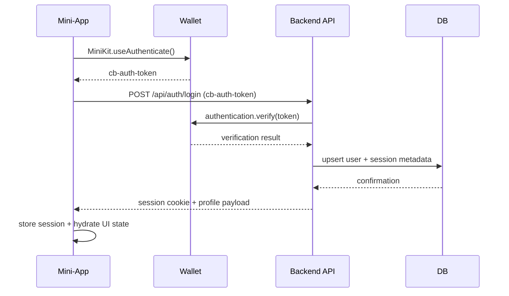
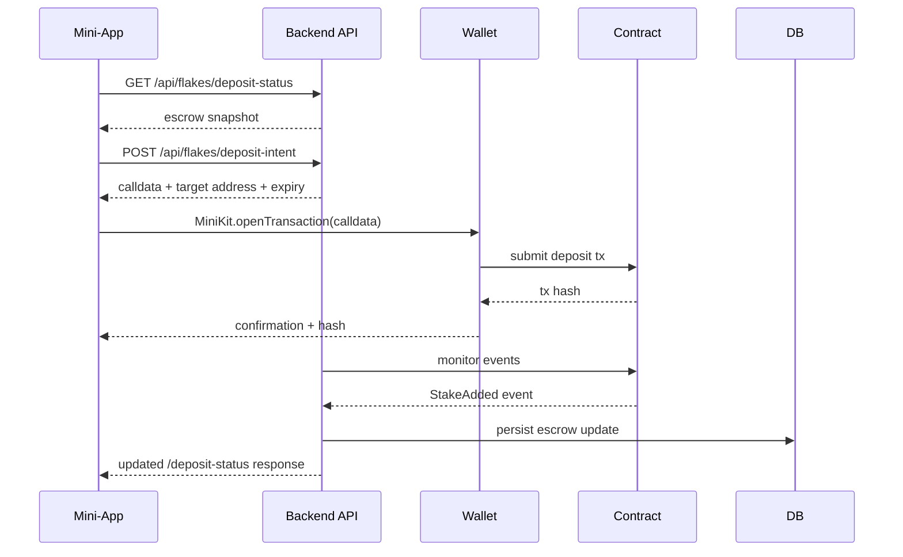
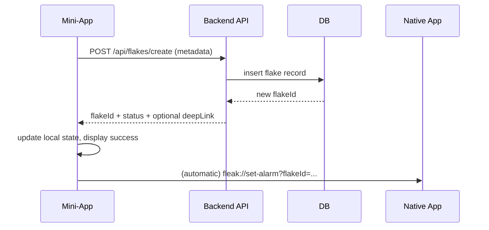
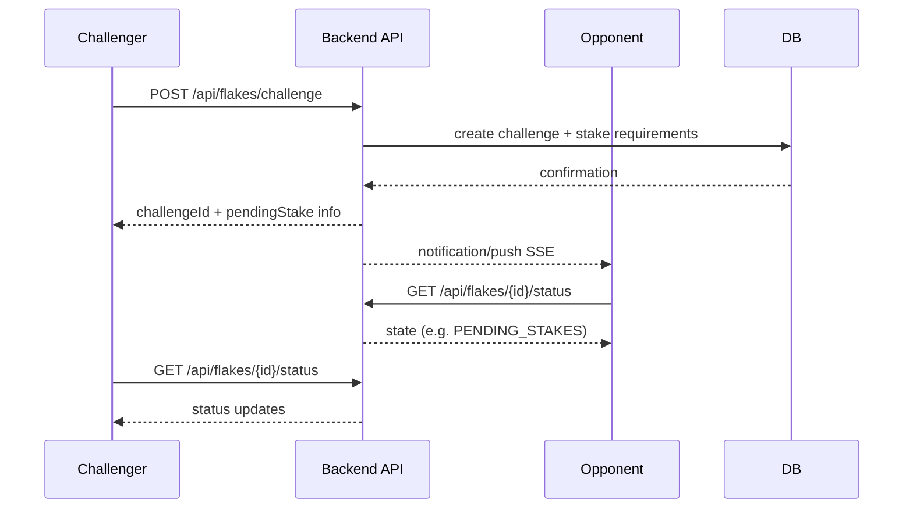
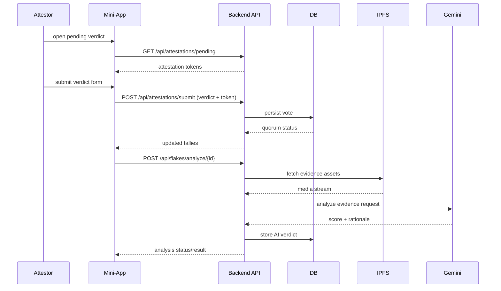
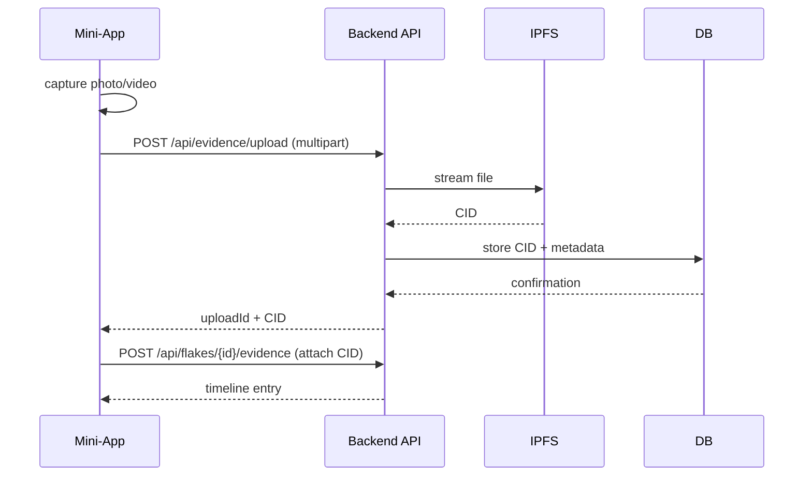
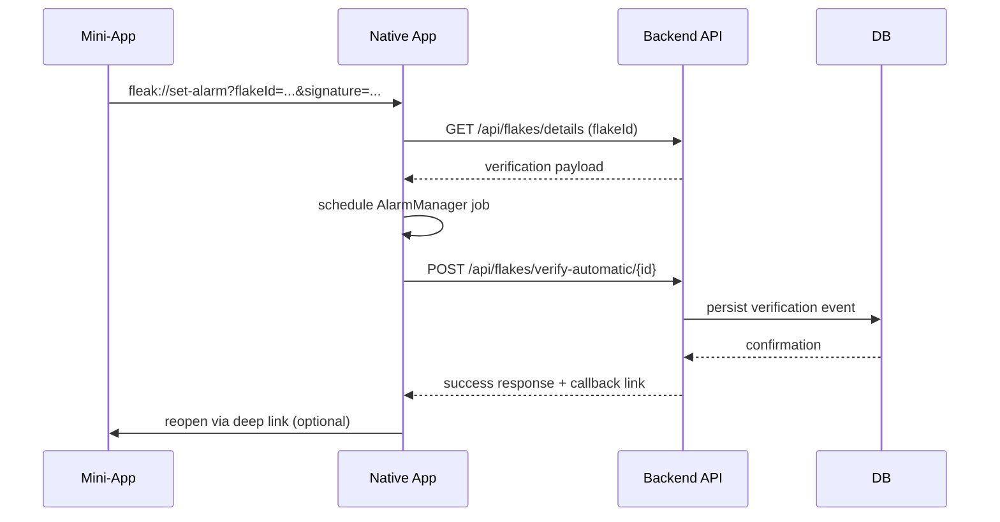
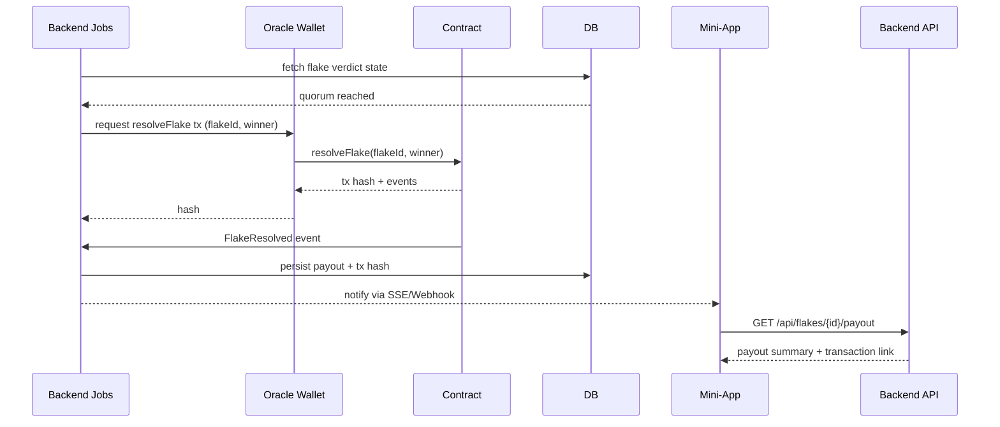

# Fleak Data Flow Playbook

This document summarises the end-to-end data movement for the critical Fleak journeys. Each section lists the participating systems, the payloads exchanged, and a Mermaid sequence diagram to visualise the integration boundaries.

## Legend

- **Mini-App**: Next.js frontend running inside the Base Mini-App webview.
- **Backend API**: Next.js API routes (controllers/services).
- **Wallet**: Base-compatible wallet runtime invoked through MiniKit.
- **DB**: MongoDB (via backend services).
- **IPFS**: Pinning service for evidence storage.
- **Native App**: React Native verifier for automatic flakes.
- **Oracle**: Backend hot wallet submitting on-chain transactions.
- **Contract**: Fleak escrow smart contract.

## 1. Login & Session Bootstrap

### Narrative

1. Mini-App calls MiniKit `useAuthenticate` to request a `0x0f26475928053737C3CCb143Ef9B28F8eDab04C7-auth-token` from the wallet runtime.
2. Token is POSTed to `/api/auth/login`.
3. Backend verifies token, persists/refreshes the user record, and issues a signed session cookie.
4. Mini-App refreshes profile and gated views using the returned payload.

### Diagram

## 2. Deposit Intent & Escrow Positioning

### Narrative

1. Mini-App queries `/api/account/summary` and `/api/flakes/deposit-status` to render current stakes.
2. When the user deposits, Mini-App posts to `/api/flakes/deposit-intent` specifying `flakeId` and amount.
3. Backend returns prepared calldata and target contract address.
4. Mini-App invokes the wallet signing flow via MiniKit.
5. Wallet submits the transaction to the contract.
6. Backend monitors confirmations (via viem/ethers) and updates MongoDB.
7. Mini-App polls `/api/flakes/deposit-status` until escrow totals are consistent.

### Diagram

## 3. Flake Creation Flow

### Narrative

1. User fills the creation wizard; Mini-App compiles metadata.
2. Request is sent to `/api/flakes/create`.
3. Backend validates inputs, reserves/creates identifiers, and stores state in MongoDB.
4. For automatic flakes, backend signs a native deep link payload and returns it alongside the new flake ID.
5. Mini-App navigates to confirmation UI and optionally opens the native app via the deep link.

### Diagram

## 4. VS Challenge (Head-to-Head)

### Narrative

1. Challenger selects a friend via `/api/friends/list`.
2. Mini-App calls `/api/flakes/challenge` with opponent ID and flake parameters.
3. Backend validates escrow coverage for both parties and creates challenge record.
4. Notifications or pending deposits are generated.
5. Participants poll `/api/flakes/{id}/status` to observe transitions.

### Diagram

## 5. Attestations (Social & AI)

### Narrative

1. Mini-App lists outstanding attestation requests via `/api/attestations/pending`.
2. Friend submits verdict through `/api/attestations/submit` with notes and optional evidence references.
3. Backend records the vote, recalculates quorum, and returns current tallies.
4. For AI review, Mini-App triggers `/api/flakes/analyze/{id}`.
5. Backend fetches evidence from IPFS, invokes Gemini, and stores structured verdict data.
6. Mini-App polls `/api/flakes/analyze/{id}/status` or receives push updates.

### Diagram

## 6. Evidence Capture & Upload

### Narrative

1. Mini-App prompts for media using browser/webview capture APIs.
2. File is streamed to `/api/evidence/upload` as multipart form data.
3. Backend pipes the stream to the IPFS pinning service and receives a CID.
4. CID is linked to the flake via `/api/flakes/{id}/evidence` and persisted.
5. Mini-App updates the flake timeline with upload progress and final CID.

### Diagram

## 7. Automatic Verification via Native App

### Narrative

1. Mini-App launches native app using signed deep link and passes `flakeId`, `authSignature`, and expiry.
2. Native app validates payload with `/api/flakes/details`.
3. Native app schedules alarm/local workflow and stores minimal state.
4. On completion, native app posts report to `/api/flakes/verify-automatic/{id}`.
5. Backend records the verification and updates flake status; Mini-App is optionally reopened via callback URL.

### Diagram

## 8. Resolution & Escrow Release

### Narrative

1. Backend monitors attestation quorum or automatic verification triggers.
2. Once conditions satisfy, backend aggregates verdicts and invokes `/api/flakes/resolve` logic.
3. Oracle signs `resolveFlake` transaction and submits to the contract.
4. Contract emits `FlakeResolved` event; backend persists transaction hash and payout breakdown.
5. Mini-App polls `/api/flakes/{id}/resolution` or listens to push updates to show final winner and funds release.

### Diagram

---

These diagrams should be treated as the integration contract reference. When introducing new services or modifying payloads ensure corresponding steps remain consistent across the Mini-App, Backend, Native App, and smart contracts.
